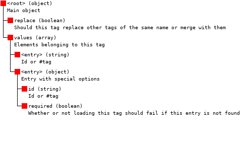

## Tags
[Back](json.md)

Tags allow for grouping of multiple items/blocks/fluids/entities in a single JSON list

File location: `/assets/<modid>/tags/<type>` where `<type>` is one of `blocks`, `items`, `fluids`, `entity_types`, `functions`, `game_events`.
Minecraft Wiki page: https://minecraft.fandom.com/wiki/Tag#JSON_format

